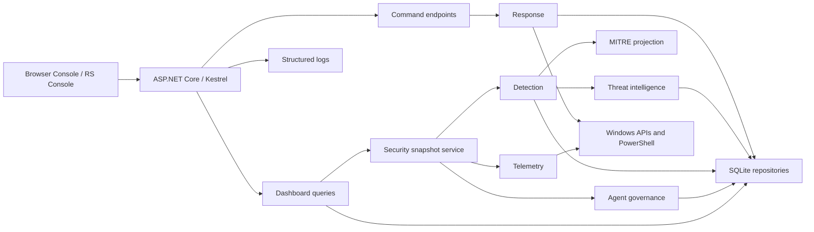

# Architecture

## System Context

RoamSentinel is a Windows-only, single-host application. Browser Console and
RS Console render the same public dashboard and connect to the same loopback
ASP.NET Core API. The application reads Windows state,
normalizes it, evaluates detections, persists evidence in SQLite, and delegates
authorized changes to a dedicated response module.

## Module Boundaries

| Module | Owns | Does not own |
|---|---|---|
| `Telemetry` | Collection and normalization | Risk decisions or actions |
| `Detection` | Rules, scores, severity, findings | Collection or remediation |
| `Response` | Validated privileged actions | Dashboard rendering |
| `ThreatIntel` | IOC normalization, caching, provider adapters | Blocking decisions |
| `AgentGovernance` | Agent identity and trust state | Direct Windows enforcement |
| `Dashboard` | Read-only section endpoints | Mutations |
| `Database` | Connections, migrations, repositories | Security policy |
| `Config` | Typed options and startup validation | Runtime state |
| `Logs` | Structured operational files | Domain persistence |
| `Core` | Contracts and records | Infrastructure |
| `app` | Composition, orchestration, commands, HTTP security | Module internals |

The dashboard never kills a process or modifies the Firewall directly.
Mutation endpoints invoke services, and repositories own SQL access.

## Runtime Data Flow

1. `WindowsTelemetryService` coalesces raw Windows observations into a
   `TelemetrySnapshot`.
2. `AgentGovernanceService` identifies governed agents and assesses their
   trust, path, running state, and network activity.
3. `DetectionEngine` evaluates enabled rules, deduplicates findings, and
   calculates per-entity and overall risk.
4. `MitreRepository` persists evidence-backed ATT&CK projections.
5. Dashboard query services shape read models for the browser.
6. Authorized commands call `ResponseService`.
7. Response attempts store actor, status, output, error, and before/after
   evidence.

## Persistence

SQLite is accessed through `IDatabaseConnectionFactory`. Migrations run in
version order at startup and are recorded in `schema_migrations`. Foreign keys,
WAL mode, busy timeout, and pooled connections are enabled.

Principal data groups:

- normalized telemetry
- security events and detection findings
- detection rules and ATT&CK mappings
- threat indicators and cached enrichment
- agent registry and activity
- response actions and recovery metadata
- consistent database backup exports and export manifests
- system settings and audit log

Repository mutations write their domain state and audit record in the same
transaction where supported.

## HTTP Surface

- `/api/dashboard/*`: ten read-only dashboard sections
- `/api/auth/*`: session login, status, and logout
- `/api/actions/*`: controlled response and agent-policy commands
- `/api/threat-intel/*`: enrichment and local IOC commands
- `/api/settings/*`: whitelisted runtime setting changes
- `/api/backup/export`: administrator-only SQLite backup archive
- `/api/logs/purge`: reviewed-event purge
- legacy `/api/*` GET routes: compatibility read models

Static files are served from `public`; no server-side UI business logic exists
in the dashboard assets.

## Extensibility Rules

- Add Windows observations through a telemetry collector and normalized model.
- Add detections as database seed/migration data plus an engine evaluation
  branch and tests.
- Add providers through `IThreatIntelProvider`; credentials remain external.
- Add response actions through `IResponseService`, authorization, validation,
  evidence capture, structured logging, and tests.
- Add schema changes as new migrations. Never edit a released migration.

See [`docs/MODULAR_ARCHITECTURE.md`](docs/MODULAR_ARCHITECTURE.md) and
[`docs/DATABASE.md`](docs/DATABASE.md) for implementation detail.
# Native Windows Application

RoamSentinel is deployed as two cooperating Windows executables:

- `RoamSentinel.exe` is the automatic Windows Service and owns telemetry,
  detection, persistence, audit, and privileged response boundaries.
- `RoamSentinel.Console.exe` is a native WPF management application. It uses
  Windows controls and communicates only with the authenticated loopback API.

Workstations and Windows Server VMs with Desktop Experience install both
components. Headless Server Core deployments use the agent-only profile and
are prepared for a separately managed enterprise console in a later milestone.
